# Contributing to Waldo

Read [AGENTS.md](AGENTS.md) for the four engineering rules. They apply to human
and agent changes: think first, use a simple design, change only the required
code, and verify the result.

## From request to release

```mermaid
flowchart LR
  A[Request and assumptions] --> B[Buddy design review]
  B --> C[Plan and acceptance tests]
  C --> D[feat branch: failing test then fix]
  D --> E[Local tests and coherent commits]
  E --> F[PR and hosted CI]
  F --> G[Fresh independent review]
  G --> H[Human test and exact-commit approval]
  H --> I[Merge through required checks]
  I --> J[Approved release from main]
  J --> K[Deploy, smoke test, rollback if needed]
```

1. State the outcome and what is outside scope. Record alternatives and the
   buddy's decision. For data work, record assumptions before a transform.
2. Create `feat/<feature>`. Keep `main` releasable. A dependent PR can target
   another feature branch; identify that dependency and retarget after it lands.
3. Define acceptance criteria and local test commands. Use test-driven changes:
   observe the intended failure, implement, then verify. Configuration and prose
   use appropriate syntax and contract checks; do not create tests that only
   repeat a sentence or implementation detail.
4. Commit coherent changes with a clear purpose. Prefer `feat:`, `fix:`, `test:`,
   `docs:`, or `ci:` followed by the result. Explain a non-obvious reason in the
   body. Keep generated data and credentials out of commits.
5. Open a PR after local verification. Include the acceptance results, test
   commands, skips, screenshots when useful, compatibility, and human test plan.
6. Run hosted CI on the latest head. Obtain a fresh independent review and fix
   its findings. New material changes require a new review.
7. Ask the owner to run or review the human test plan and approve the exact PR
   head. The owner currently approves in this project chat. GitHub cannot accept
   an approving review from the same account that authored the PR.
8. Record both approval attestations on that commit. Merge only through the
   required checks. Release and deployment are separate gated actions.

Task authorization permits implementation and a PR. It does not count as human
approval of code that has not yet been reviewed. A phase is ready when its
acceptance tests, CI, independent review, and human test evidence are complete.
Do not call an unmerged phase released.

## Review evidence

The PR description links the plan and records the reviewer session identity,
reviewed SHA, findings, and how they were resolved. The orchestrator posts an
`Independent review` status only after a fresh reviewer has checked that SHA.
The `Human approval` status stays pending until the owner explicitly accepts
that exact PR head and its human test result. Keep the evidence in the PR, with
private test details summarized rather than uploaded. New commits need new
statuses. The statuses can enforce waiting; they cannot establish review quality
by themselves. The owner checks the underlying evidence.

## Validation and runners

- Use the frozen Python and npm lockfiles. Run Ruff, relevant pytest checks,
  the UI type/build/lint checks, and Playwright for affected browser behavior.
- Use a disposable PostgreSQL database for migration and authorization tests.
  Never point a destructive test fixture at the running user database.
- Hosted CI uses small synthetic fixtures, PostgreSQL, Redis and MinIO. A green
  Linux job does not qualify Apple MLX, CUDA, every codec, or model accuracy.
- Test real inference on the trusted local installation when relevant. Record
  hardware, model/checkpoint, thresholds, sampling, elapsed time and limitations.
- Keep runners unprivileged. Pin third-party Actions to reviewed commit SHAs,
  use read-only PR permissions, and keep release credentials out of PR jobs.
- A skipped worker/model test is not evidence that its integration passed.
  Identify the missing gate and complete it before a release that depends on it.

### Read the CI evidence

Open the PR's **Checks** tab, then a check's **Details** link. The Actions run
summary shows test totals, failed and skipped cases, step outcomes, and the
source commits. PR runs test GitHub's candidate merge commit; the report also
identifies the PR head. Do not confuse a green check with approval of another SHA.
Sign into GitHub in that browser to view logs and download artifacts. A connected
GitHub tool or CLI login does not sign the browser in.

The run's **Artifacts** section contains backend JUnit results and the browser
HTML/JUnit report. Browser failures retain a screenshot and trace. Synthetic
overlay screenshots are also retained. Reports expire after 14 days. Download
the browser report and open it with `npx playwright show-report <report-folder>`.
Only synthetic CI data belongs in these reports; never upload local credentials,
`test_data/`, or recordings from the human's installation.

| Check | What it establishes | What it does not establish |
| --- | --- | --- |
| Lint + Test + Build | Python regressions; migrated PostgreSQL contracts and export races; Redis/MinIO round trips; UI type/build/lint; secret scan | Complete Celery workflow, real inference, model accuracy, GPU compatibility, or a tested container image |
| UI browser smoke | Real UI rendering and synthetic video playback with controlled API responses | Browser-to-production-backend integration or model quality |
| Independent review | A separate reviewer inspected the named commit and its evidence | An automated test or owner approval |
| Human approval | The owner accepted the named commit and human test result | An automated test or a release deployment |

Known gaps: worker-dependent API tests can skip when no worker completes a job.
The two opt-in suites in `test_e2e.py` and `test_e2e_full.py` also need repair:
one expects automatic export, and the other expects training from one source
group. Neither qualifies the current workflow. A separate worker-integration PR
must repair these assumptions, run a real queued workflow, and fail if a
required worker does not complete. Real SAM/MLX/CUDA and accuracy checks remain
separate hardware/model qualification. The documentation build is currently a
local check and a main-branch workflow, not a required PR check.

## Data and model experiments

The entire `test_data/` directory is ignored, including labels and metadata.
`Test_Video/` is also ignored to support the name first used for this corpus.
Do not add private media to Git, Docker builds, or CI uploads. Tiny synthetic
fixtures can be committed under the existing fixture directories after checking
size and origin. Files over 1 MiB require an explicit review justification.

Record schema, types, nulls, units, coordinates, timebase/origin, index alignment,
source grouping and leakage risk before data work. Group adjacent clips from
one drive/site/date together. Separate development, validation and frozen holdout
data. Do not tune on the holdout. With no ground truth, report observations and
runtime behavior, not accuracy.

For each model experiment, record the code SHA, dataset/manifest identity, model
artifact, fixed seed, changed factor, metric/target, budget, result, and comparison
to the baseline. Keep sensitive manifests local. Do not silently change default
hyperparameters, prompts, thresholds, units, column names or artifact formats.

## Release and deployment

On October 9, 2026, `main` protection was configured to require `Lint + Test +
Build`, `UI browser smoke`, `Independent review`, and `Human approval`, with
current-branch checks, resolved review threads, administrator enforcement, and
no force pushes or deletion. The `release` environment requires owner approval
and permits only `main`. These remote settings must be checked when the repository
is copied or recreated; source files alone do not install branch protection.

The legacy release workflow is disabled while this change is reviewed. Before
re-enabling publishing, the owner must move Docker Hub credentials from repository
secrets into the protected `release` environment and remove the old repository
copies. GitHub does not expose saved secret values, so an agent cannot copy them
from the API. No existing secret has been deleted or rotated by this change.

Publish only reviewed `main` code after required checks and explicit owner
approval. Do not publish automatically from a feature branch or create a tag as
a substitute for approval. Use the gated release workflow, record image digests,
and validate the deployed version. Keep the prior image and database backup for
rollback. An append-only migration can require a forward repair; do not promise
that reverting a container reverses its schema changes.

The first adoption PR contains the prior audit baseline. Its larger scope is a
one-time recorded exception, not a pattern for new features. Subsequent PRs must
follow the feature boundaries in the plan.
