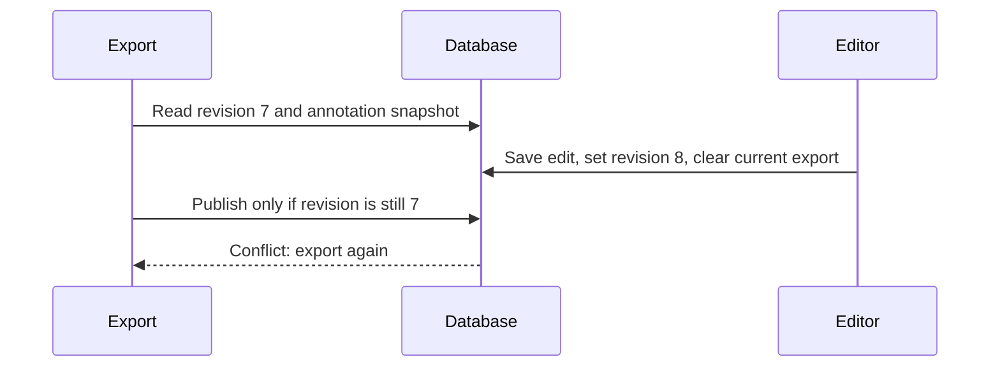

# Waldo delivery plan

## Intent and agreed decisions

The owner wants a video evidence tool that finds physical cameras in footage
and supports source-time and later geographic inspection. The next changes must
use paired design, test-first implementation, small feature branches, CI, fresh
independent review, and explicit owner approval before merge or release.

Root and the independent `phase_decision` Sol session agreed on October 9:

- Capture the existing tested audit as one catch-up PR with backend/runtime,
  UI, documentation, and governance/CI commits. The code is coupled; splitting
  Python files by topic would create broken intermediate imports. Final-tip
  integration is the merge gate. This is a one-time scope exception.
- Start native assessed-frame storage as the next separate feature PR. Extending
  the image `Frame` table would change unrelated export/upload contracts and
  require fake or nullable image objects for empty assessments. A small table
  with existing job/video ownership is the simpler sound choice.
- Use an existing job ID as the stable run key, not as proof that every job field
  is immutable. Keep source-relative seconds and timing provenance; raw integer
  PTS/timebase, capture UTC, chunks, maps and localization are outside this slice.
- Keep seven private 4K HEVC videos as development data. They have nominal 24 fps
  metadata but no ffprobe-visible telemetry stream. Rate metadata alone does not
  prove constant timing, and absence of a visible stream is not proof that every
  possible metadata source is absent. No accuracy or geolocation target is set
  without labels, calibration and a separate holdout.

Root and `ci_design` Sol agreed to hosted, disposable PR runners. Private video
and GPU tests stay on a trusted local branch. Automatic image publication is
replaced by a manual main-only release with CI/review checks. The human owner
approves in chat because GitHub cannot accept the PR author's own review.

The fresh `baseline_review` session found that retries could replace reviewed
annotations. Root, `vision_fixes`, and `agent_fixes` agreed to reuse completed
clip transactions and commit completion metadata with new observations. A
historical job with observations but no completion record must stop before
replacement. New evidence invalidates a partial export; completed redelivery
preserves the existing artifact and review. This is serial retry protection,
not a claim of exactly-once execution.

The same review found Redis's one-hour redelivery timeout below the configured
task limits. Root and `vision_fixes` chose a consistent 25-hour visibility window
as the narrow fix. All broker consumers must restart with it. The current `solo`
workers do not enforce task runtime limits; overlap after 25 hours and delayed
crash recovery remain limits. Job serialization or supervised execution is a
separate follow-up before unattended long workloads.

The PyTorch retry fix removes automatic conversion. The `phase_decision` buddy
found that classification and pose lacked reviewed exporters. The owner chose
to retain both modes and add those exporters before this PR lands. Root and the
buddy agreed on this bounded contract:

- Classification exports rectangular crops from each saved polygon envelope
  with the existing five-pixel padding. Pose exports one polygon centroid
  keypoint and the saved valid box, or polygon bounds when the box is absent.
  These are object crops and centroid labels, not whole-frame classification
  or skeleton estimation. Exact masks and disconnected mask components cannot
  be recovered from the stored largest-contour polygon.
- Polygon coordinates are finite normalized source-image coordinates. Missing,
  invalid, or zero-area geometry must stop the export with an actionable error.
  Class folder names must be safe single path components; do not silently rename
  labels. Keep the existing policy of exporting pending and accepted annotations
  while excluding rejected annotations. A rejected-only frame is not a negative.
- Preserve deterministic source-video splits and annotation order, immutable
  export keys, task-matching artifact selection, and invalidation after edits.
  Record the geometry method and source annotation identity in the manifest.
- Classification uses `train/<class>` and `val/<class>` folders. Its training
  handoff must validate that layout and pass the dataset directory to YOLO.
  Register class indices in sorted folder order, which is the classifier's
  mapping. Keep the existing independent-source-group gate and all training defaults.

Acceptance before the text retry change lands: tests must reproduce the missing
formats and classification handoff failure, then verify real crop pixels,
centroid labels, review edits/status, invalid geometry and class paths, source
splits, authorization, immutable exports and the model's dataset argument.
Browser tests must cover both format requests and mixed-task bulk exports.
No model training, new keypoint schema, or accuracy claim is part of this fix.

Final review found a concurrent edit/export race. Root and `phase_decision`
chose an integer `evidence_revision` on each job. Each evidence change increments
it and clears the current export in one transaction, even if that pointer was
already null. Export reads the revision before its annotation snapshot and
publishes the task-matching artifact only if the revision still matches. This
keeps ZIP creation outside a long database lock. A conflict returns HTTP 409;
the user can export again. Existing training snapshots remain immutable.
Training creation uses a short job lock to serialize its snapshot selection
with invalidation. Exemplar conversion retains its existing transaction and
reuses completed results on redelivery.

Acceptance: an append-only migration defaults existing jobs to revision zero
without changing saved artifacts. Independent PostgreSQL connections must prove
both edit-before-publication and publication-before-edit orders. All annotation
writers and zero-detection clip completions must invalidate the export. Tests
also reject case-folded/Unicode-equivalent class folder collisions and require
non-empty image files for every classification class in both splits.

## Wave 0: establish the contribution boundary

Files: `AGENTS.md`, `CONTRIBUTING.md`, `.github/pull_request_template.md`, existing
workflow files, the release guard and its tests, and the contributor guide.

Acceptance:

- All four rules are explicit and use simple language.
- Design decisions require a buddy. Final PR review uses a fresh session.
- Human approval is tied to a PR and commit, separate from task authorization.
- `test_data/` and `Test_Video/` are ignored by Git and Docker; no private files
  are tracked. CI receives only small synthetic fixtures.
- CI runs backend/service checks and all browser smoke tests with read-only
  permissions. Action refs are pinned. Release guards have observed failing tests
  and reject feature-branch, stale, missing-check, and unapproved release attempts.
- Branch protection requires CI plus independent and human approval statuses.
  Post-merge release commits require fresh status verification on their exact SHA.
- The catch-up PR has a fresh independent review, a human test plan, and actual
  remote CI results. It stays unmerged until the owner approves.

The owner's CI review found that passing jobs did not expose useful evidence.
Root and `ci_design` agreed on a bounded reporting change in this adoption PR:
keep the required check names, publish actual JUnit totals and skipped reasons,
retain browser reports/failure traces and synthetic screenshots for 14 days,
and identify both PR head and tested merge commit. Reports must preserve test
failures and show missing, malformed, or empty results as unavailable. Use only
allowlisted synthetic artifacts and read-only PR permissions. Verify the reports
on a fresh hosted run and repeat independent review on the new head.

This adds review evidence, not coverage. A separate `feat/worker-integration`
PR should test the real queue/storage/review/export handoff, fail on required
worker timeouts, and repair the two stale opt-in end-to-end tests. It needs its
own paired design and acceptance tests. Hardware inference and model accuracy
remain separate gates; no percentage target is inferred from a test count.

### PR review follow-up: repeated model activation

The external review of `34e1606` found that activation and champion promotion
could clear the selected model's persisted active flag. The bulk update changed
the database row without synchronizing the loaded ORM object; assigning `True`
again then produced no update. Root and the `activation_fix` Sol buddy chose to
exclude the selected model from both bulk deactivation queries, matching the
existing alias-clearing query. This avoids adding a synchronization step.

Data assumptions: model IDs are UUIDs, `is_active` is the persisted Boolean,
and workspace ownership follows the model's project. Tests must read committed
rows through a fresh session; an in-memory ORM flag is not sufficient evidence.
No schema, model artifact, training default, or concurrency policy changes.

Acceptance and sequence:

1. Reproduce the failure through the real API and SQLAlchemy persistence for
   repeated activation and promotion of an active model to champion.
2. Exclude the selected row. Verify repeated requests preserve default model
   selection, switching deactivates other owned models, and foreign-workspace
   models retain their active flags and aliases.
3. Run the regression suite and hosted CI on the new head. Reply to the review
   finding with that commit and test evidence, then request a fresh review in
   the original independent review session. Owner approval remains separate.

### Second PR review: decoded coverage, export aliases, and canvas pixels

The review of `51df924` confirmed the activation fix and found three additional
regressions. Root paired with separate Sol agents for each change:

- `video_eof_fix`: use the validated decoded timing count for native iteration,
  rather than OpenCV's duration/FPS estimate. Reject a capture that stops before
  that count or continues beyond it. FFprobe error diagnostics must not become
  apparently complete timing evidence. Missing executable or missing/invalid
  timestamps without decode diagnostics retain the explicit FPS fallback.
- `transformer_export_fix`: treat `detect_transformer` as `detect` only when
  choosing the current training export. Preserve the job's task identity,
  immutable ZIP keys, and revision check. Other export formats remain downloads
  without replacing the current training artifact.
- `canvas_review_fix`: clear the full canvas before applying pan/zoom. The
  failed CI trace also showed the previous decoded image paired with the next
  mask. Wait for the requested frame's presentation as well as seek completion.
  A canceled caller must stop before painting. Keep its bounded decoder wait
  available to a same-frame retry, because an unchanged paused frame may not
  produce another presentation callback. A new target replaces the old wait.
  Approximate timestamps must not gain masks or an exact-timing claim.

Data contract: decoded frame indices are zero-based presentation-order indices.
PTS values are finite seconds relative to container start; duration is positive
seconds or unknown. Metadata counts are estimates. Decoder agreement establishes
coverage of the available input, not proof that the original recording is whole:
truncation at a valid packet boundary can leave no error signal. Without valid
PTS, count disagreement remains an explicit inability to verify coverage.

Acceptance: a real six-frame VFR fixture with an inflated metadata count must
retain all six source timestamps. Observable decode gaps/errors must fail. Real
ZIP and training-snapshot tests must prove detection-alias publication; both
PostgreSQL edit/export race orders must preserve the revision contract. Browser
pixel tests must prove an exposed pan strip is clear and comparison masks stay
within the existing two-pixel tolerance. Do not weaken assertions or add retries
to hide the CI failure. Run local suites, hosted CI, and a fresh independent
review on the final commit before asking the owner to approve it.

### Third PR review: workflow editing on LAN HTTP origins

The review of `4b51120` confirmed all four earlier fixes and found that workflow
node creation assumes `crypto.randomUUID` exists on every origin. It is absent
on ordinary non-loopback HTTP origins. Root and Sol `workflow_uuid_fix` chose
feature detection with a 128-bit `crypto.getRandomValues` fallback. This keeps
the secure-origin ID format and existing saved IDs unchanged. IDs are opaque
strings; no UUID dependency or formatting abstraction is needed.

Acceptance: with `randomUUID` unavailable, loading a saved workflow and adding
two palette nodes must preserve the saved ID, produce distinct new IDs, and
raise no page error. Run the regression before and after the fix, UI build/lint,
the full browser suite, hosted CI, and a fresh review on the final head.

## Wave 1: durable native frame assessments

Branch: `feat/durable-source-time`, initially based on the catch-up PR.

Files: one new Alembic revision, `lib/db.py`, `labeler/video_labeler.py`,
`app/api/review.py`, and focused schema/pipeline/API tests. Update only relevant
data-model and API documentation. No generic indexing framework or new UI.

Data contract:

- One completed assessment is owned by a job and video and keyed by the native
  decode index: unique `(job_id, video_id, source_frame_index)`.
- Persist source-relative seconds, timing method, optional frame duration,
  positive source width/height, and nonnegative detection count. Count zero means
  the frame was assessed with no detections; a missing row is not a negative.
- Exact-source and FPS-derived fallback times remain distinct. These seconds
  are not raw PTS ticks or recording UTC. No geographic coordinate is inferred.
- Frames with detections can retain the existing image artifact. Empty assessed
  frames do not create a fake image object.
- Commit a video's assessments and annotations together. Retry must not erase
  reviewed evidence or duplicate a committed assessment. Completed redelivery
  reuses its result. A partial retry reuses completed video transactions.
- A paginated, authorized job endpoint returns rows in stable video/frame order.
  Historical or derived jobs without native rows report unavailable coverage,
  not a successful count of zero. Source runs retain their own evidence.

Test-first sequence and acceptance:

1. Add a failing schema/write test for empty and positive assessments, uniqueness
   and transaction rollback. Add the model and append-only migration. Verify
   against a disposable PostgreSQL database populated at the previous head.
2. Add failing pipeline tests for a reopened database, variable source times,
   timing fallback, and completed/partial redelivery with accepted or edited
   annotations. Implement persistence and reuse without model reruns for a
   committed video. Verify counts, source identity and review state.
3. Add failing API tests for authorized reads, foreign workspace denial, invalid
   IDs, deterministic pagination and unavailable historical coverage. Implement
   the endpoint using the existing resource authorization.
4. Run the relevant full backend and browser suites, migration checks and CI.
   Use a bounded local test on the supplied footage to qualify decoding/time
   provenance. Two short development clips have fewer decoded frames than the
   container-reported count; OpenCV and ffprobe agree on the decoded count.
   Reproduce this with a small synthetic fixture. Distinguish a metadata count
   mismatch from a decoder failure before changing the current early-stop check.
   Do not train a model or tune on this data.
5. Obtain fresh independent review on the final PR head. Provide a human test
   plan with source-time evidence and restart/retry checks. Fix findings, then
   request the owner's exact-head approval. Do not merge the prerequisite or
   this feature without that approval.

Later waves remain in the architecture roadmap: qualify perception backends on
an agreed holdout, add telemetry/calibration/localization with uncertainty,
build synchronized map/evidence/timeline search, then expose bounded agent tools.
Each wave gets its own paired scope, data contract, acceptance tests and PR.
Desktop and System 1 work remain on hold.
