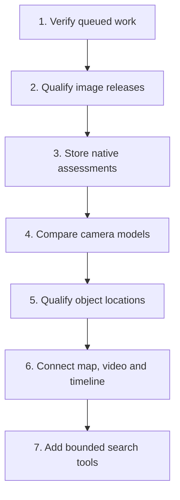

# Next-wave delivery plan

> For agents: use paired design and test-first implementation for each wave.
> Use `superpowers:subagent-driven-development` or `superpowers:executing-plans`
> for implementation. Obtain a fresh independent review before requesting merge.

**Goal:** Establish a tested worker and release path, then add durable video
assessments that support camera search.

**Architecture:** Keep Python workers, PostgreSQL metadata, MinIO artifacts,
and the React interface. Extend the existing queue and release guards. Do not
replace these systems or introduce a second approval mechanism.

**Tech stack:** FastAPI, Celery, Redis, PostgreSQL, MinIO, React, GitHub Actions,
and Docker Hub.

**Specification:** The owner's instructions, [contribution rules](../../CONTRIBUTING.md),
[accepted assessment scope](2026-10-09-delivery.md#wave-1-durable-native-frame-assessments),
and [architecture roadmap](../../docs-site/docs/architecture/roadmap.md).

## Starting point and decision

[PR #20](https://github.com/oldhero5/waldo/pull/20) merged on October 10, 2026
as `edb935cd1e314b1af53e7b0e15847c6d37a24ae6`. It is closed. Its reviewed head
was `3fa46e6e821c3df059d42a61bca8976cc03178eb`. Its
[continuous integration (CI) run](https://github.com/oldhero5/waldo/actions/runs/38070243963)
recorded 723 backend passes, 16 skips, and 96 browser passes with no skips.
Those results qualify that head only. They do not prove full worker operation,
hardware inference, physical-camera accuracy, or release-image behavior.

The orchestrator and Luna buddy `/root/next_wave_buddy` compared three next steps:
worker integration, release machinery, and the previously planned assessment
schema. We chose worker integration first, then release machinery, then the
schema. A release pipeline alone would package an unqualified worker flow.
Adding the schema first would increase the behavior that needs qualification.
This reorders the work; it does not cancel the accepted assessment design.

This PR changes rules and plans only. It does not implement these waves, enable
publishing, migrate secrets, or deploy an application release.

## Constraints and review focus

- Use plain English, roughly 80% aligned with ASD-STE100. Every PR must explain
  its problem, result, checks, limits, human test steps, and rollback.
- Use Sol for implementation and independent review. Use Luna for bounded
  inventory and documentation. The final reviewer must not author the change.
- One wave becomes one focused PR, with coherent commits inside it. Split a wave
  if its final scope no longer fits one review. Do not reopen the catch-up PR.
- Keep private `test_data/` and all derived media outside Git, builds, and CI.
  Use synthetic CI fixtures. Use the private videos only as local development data.
- Keep model, seed, prompt, metric, and split changes explicit. No model change
  or claimed accuracy target is part of the first three waves.
- Recorder GPS is not object position. A missing assessment is not a negative.
  Source-relative seconds are not recording UTC. A local track is not an asset.
- Keep local Ollama as the first chat test path. Desktop and System 1 work remain
  on hold. Private media must not be sent to a cloud model without permission.

Review the conditions that can produce false success: a worker that never starts,
an empty or failed inference result, a retry after human edits, an image rebuilt
after testing, and missing historical coverage. Each owning wave below must
test these conditions. A skipped required check cannot qualify its wave.

## Wave 1: qualify the queued worker flow

Branch: `feat/worker-integration`.

Inspect and change only the needed parts of `.github/workflows/test.yml`,
`tests/conftest.py`, `tests/test_api_extended.py`, `tests/test_e2e.py`, and
`tests/test_e2e_full.py`. Add `tests/test_worker_integration.py` for the bounded
service test. Reuse the production task entry points in `lib/tasks.py`; do not
add a test bypass to public request handling. Update the testing guide.

The test consumes synthetic video through the real API, Redis queue, and a
separate Celery process. It writes to disposable PostgreSQL and MinIO. Substitute
only the inference boundary in that test process with deterministic detections,
empty results, or errors. Never run the service test against the user's database.
This qualifies orchestration; a separate trusted hardware run qualifies models.

- [ ] Agree with a Sol buddy on the smallest test-only inference fixture and
  record source identity, frame times, geometry units, null meaning, and cleanup.
- [ ] Write failing cases for a missing worker, worker timeout, inference failure,
  and explicit review/export. Required missing services must fail, not skip.
- [ ] Start disposable services and a real worker in CI. Prove upload → labeling
  → review edit → explicit export → authorized download. Inspect saved geometry,
  source IDs, and archive contents, not only HTTP success codes.
- [ ] Prove an empty result stays empty; a failed job cannot become completed;
  retry after a committed clip preserves human edits and does not duplicate rows.
  Test a controlled worker restart. Do not claim general crash recovery or
  exactly-once execution from one restart case.
- [ ] Repair live-test assumptions: request a reviewed export, and use separate
  synthetic source groups for training. Do not make copies of one clip stand in
  for independent validation. Keep real training in the opt-in hardware suite.
- [ ] Run the new test and affected regressions on the disposable stack, then
  the required CI suites. Publish separate results for deterministic orchestration
  and any real-model test. Required worker cases must have zero skips.

**Acceptance:** The service test passes with a worker and fails within its stated
timeout without one. It preserves reviewed evidence on retry and returns the
edited export. A bounded local hardware test records backend, checkpoint,
sampling, elapsed time, and peak memory. It makes no camera-accuracy claim.

**Human test:** On the trusted local build, label a short development clip, edit
one result, export, and retry. Verify the saved edit and visible failure state.
Record the code SHA and limits. Keep private evidence local.

**Rollback:** Revert this wave's test/runner changes. If a product defect needs a
fix, record its own regression and rollback in this PR before expanding its scope.
Do not remove a required check just to make a failing run green.

## Wave 2: qualify Docker Hub releases

Branch: `feat/verified-image-release`; depends on Wave 1.

Primary files: `.github/workflows/release.yml`, `.github/scripts/check-release.sh`,
`tests/test_release_gate.py`, and `docs-site/docs/deployment/docker.md`.
Inspect `Dockerfile` and `Dockerfile.cuda`; change them only for a demonstrated
image failure. No schema or application feature changes belong in this wave.

- [ ] Pair with Sol on a single artifact flow: build each image once, test it,
  then publish that same artifact. Choose local Open Container Initiative (OCI)
  archives or staging digests based on runner capacity and hardware access.
  Record the choice before implementation; do not rebuild after qualification.
- [ ] Extend failing release-guard tests for stale source commits, missing or
  failed image evidence, missing approval, and an incomplete CPU/CUDA pair.
  Reuse the existing main-commit and approval checks.
- [ ] Build CPU and CUDA images from the same reviewed main commit. Record each
  digest, source SHA, software bill of materials (SBOM), and build provenance.
  Scan the exact artifacts. Fail on unfixed critical/high findings unless the
  owner approves a documented, scoped exception with an expiry and repair issue.
- [ ] Test startup, health, disposable migrations, and the Wave 1 handoff using
  the candidate images. Record actual CUDA inference on a trusted NVIDIA host
  before claiming CUDA support; a CPU startup test is insufficient. Missing
  intended-hardware evidence blocks that image's release qualification.
- [ ] Recheck main and approval after the protected release environment opens.
  Keep Docker Hub credentials only in that environment. The owner must provision
  them and remove old repository copies before publishing is enabled.
- [ ] Publish versioned images only after both candidates pass. Promote their
  existing digests to the channel tags and write a release manifest for the pair.
  Record source commit, image digests, checks, known limits, and rollback commands.
- [ ] Test failure after the first image/tag update. Registry tag updates are
  not atomic. Do not mark the release complete or deploy a mismatched pair.
  Record how to finish or restore tags from the previous manifest.

**Acceptance:** A dry run proves every rejection path without publishing. An
owner-approved release publishes the tested digests, then deploys those digests
to the test stack and passes health plus a bounded worker smoke test. Failed
publication leaves an explicit incomplete record. Publishing remains disabled
until credentials, required hardware evidence, and owner approval are available.

**Human test:** Review the release manifest, run the documented pull/start steps,
and inspect a short labeling/review/export flow. Verify the previous manifest
can restore the prior image pair. Do not delete persistent volumes.

**Rollback:** Restore the prior approved digests. Container rollback does not
reverse a database migration; retain a checked backup and document forward repair.

## Wave 3: store durable native assessments

Branch: `feat/durable-source-time`; follows the delivery gates above.

Use the accepted scope in the [previous plan](2026-10-09-delivery.md#wave-1-durable-native-frame-assessments).
Primary files: `lib/db.py`, one append-only Alembic revision,
`labeler/video_labeler.py`, `app/api/review.py`, and focused schema/pipeline/API tests.

- [ ] Reconfirm the small assessment-table design with Sol. Keep unique
  `(job_id, video_id, source_frame_index)` ownership and source-time provenance.
- [ ] Write failing tests for completed empty assessments, positive results,
  uniqueness, reopened database reads, and transaction rollback.
- [ ] Store assessments and annotations in the same video transaction. Test
  completed/partial retry with accepted and edited annotations using Wave 1's
  service test. Missing historical rows must report unavailable coverage.
- [ ] Add authorized, stable pagination; test foreign-workspace denial and
  exact versus FPS-derived timing. Test migration from the prior populated schema
  in a disposable database. Do not manufacture image artifacts for empty results.
- [ ] Verify variable-frame-rate source times with a synthetic fixture and a
  bounded local development clip. Do not equate metadata counts with decoded
  counts or source-relative seconds with recording time.

**Acceptance:** A restart preserves empty and positive assessments, retries
preserve edits, and the API returns deterministic authorized coverage. The human
can inspect source-time evidence without a false completeness claim.

**Rollback:** Retain the additive table when reverting application code. Check
compatibility and document a forward repair; do not drop persisted evidence.

## Later product work

These are separate design and measurement gates, not features in this PR.

| Order | Work | Evidence needed before implementation or selection |
| --- | --- | --- |
| 4 | Compare camera perception backends | Versioned labeled corpus; site/drive/date holdout; fixed seed and budget; brief/small-camera event recall, false positives per video-hour, elapsed time and peak memory. Recheck the existing shortlist before choosing models. No default change from a model name alone. |
| 5 | Telemetry and object localization | Time-aligned pose, calibration and coordinate units; surveyed controls; position error and uncertainty. Unknown pose stays unknown. Recorder GPS cannot stand in for the observed camera. |
| 6 | Map, evidence cards, source player and timeline | One selection refers to the same source evidence in every view; sparse masks align with decoded frames; unknown locations and coverage gaps remain visible; keyboard and error paths pass. |
| 7 | Bounded natural-language tools | Authorized evidence IDs and citations; deterministic spatial/time calculations; cost limits, cancellation and failure behavior. Test with local Ollama first; hosted providers need their own key and tool-contract checks. |

At each wave: reproduce the failure, make the smallest change, verify locally,
commit coherent groups, run current-head CI, obtain fresh independent review,
fix findings, and request owner approval of that exact head. Approval of this
plan does not approve a later PR, release, or model/data-use change.
